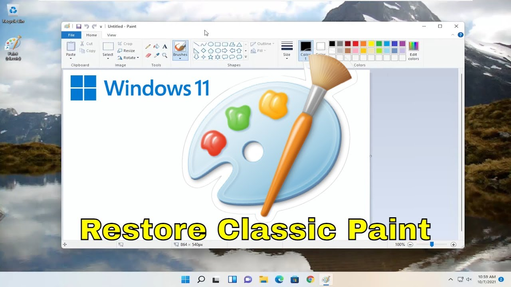

# Mspaint 
Classic Paint for Windows 11

* Classic Snipping Tool & Classic Calculator Links Above

Built from Windows 11, version 24H2 (26100.1742) Enterprise/Windows-Server all genuine files.

Installs on any Windows 11 64bit, (Only 64bit)

Default version is English language, (en-US)

Run installer **Mspaint-Installer-x64.exe** and input "paint" as password to start the install.

* Installer built with WinRAR, mspaint.exe installs to system32

> [!IMPORTANT]
> Disable app execution alias mspaint.exe & pbrush.exe by typing  `ms-settings:advanced-apps`
in the run dialog, (Win+R) and press OK. 
If you omit this step, you will have the default inbox mspaint.exe running by default.

The installer detects what language you have installed in your Windows, 
and will provide the appropriate MUI file automatically.  It comes with
the following locales:
				

ar-SA, bg-BG, cs-CZ, da-DK, de-DE, el-GR, en-GB, es-ES, es-MX, et-EE,  fi-FI, fr-CA, fr-FR
he-IL, hr-HR, hu-HU, it-IT, ja-JP, ko-KR, lt-LT, lv-LV,  nb-NO, nl-NL, pl-PL, pt-BR, pt-PT
ro-RO, ru-RU, sk-SK, sl-SI, sr-Latn-RS,  sv-SE, th-TH, tr-TR, uk-UA, zh-CN, zh-TW

Download here: [Mspaint-Installer-x64.exe](https://github.com/dobbelina/Mspaint/releases/latest/download/Mspaint-Installer-x64.exe)

* Thanks to [mspaintmsi](https://github.com/mspaintmsi/superUser) for the Trusted Installer utility 

